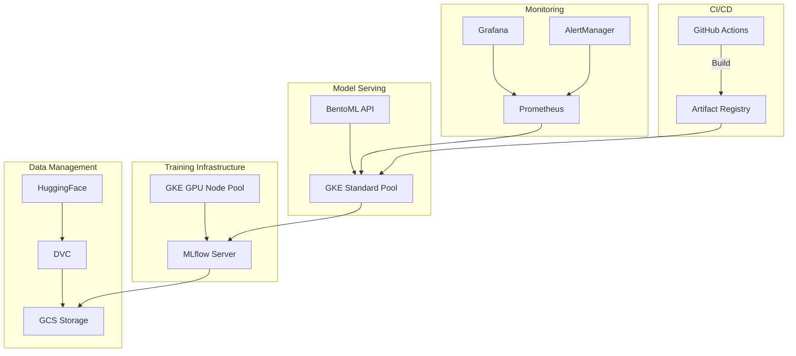
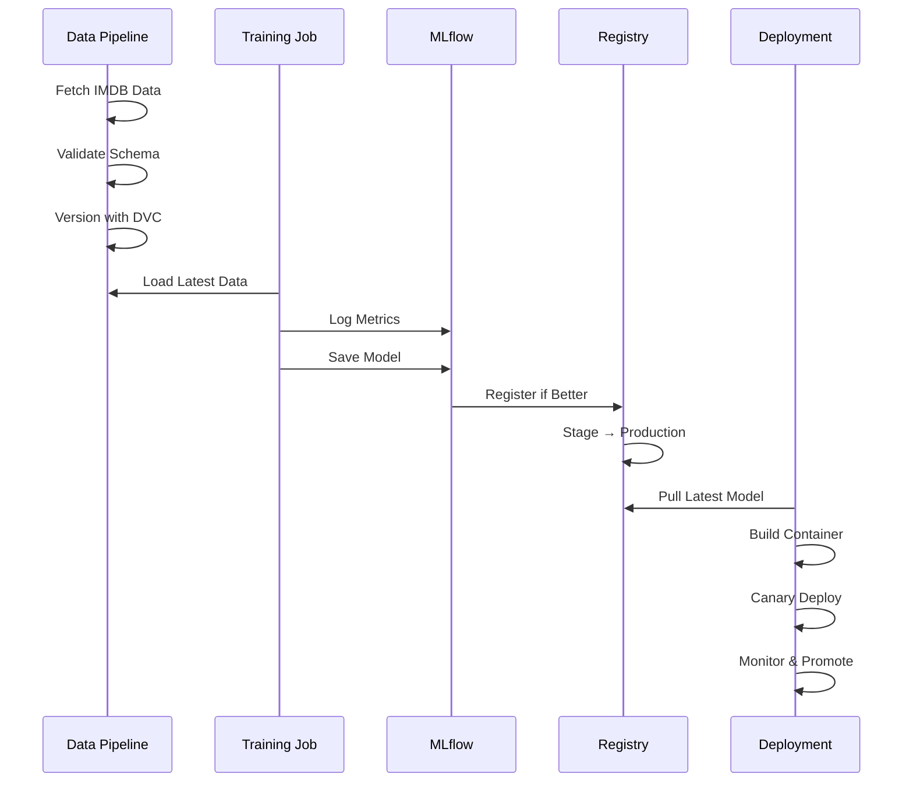

# SentimentOps: DistilBERT Sentiment Analysis with End-to-End MLOps

## Runbook

### Model Retraining and Deployment

#### Prerequisites

- Access to GCP project with required permissions
- `gcloud` CLI configured with the project
- `kubectl` configured to access the GKE cluster
- Python environment with required dependencies (see `requirements.txt`)

#### Retraining Process

1. **Data Preparation**

   ```bash
   # Fetch latest data
   python data/fetch_data.py

   # Validate data quality
   python data/validate_data.py

   # Version the data with DVC
   dvc add data/raw
   dvc push
   ```

2. **Training**

   ```bash
   # Start training job on GKE
   kubectl apply -f infra/k8s/training-job.yaml

   # Monitor training progress
   kubectl logs -f job/sentiment-training

   # Check MLflow UI for metrics and artifacts
   # Access at: http://mlflow.your-domain.com
   ```

3. **Model Evaluation**

   ```bash
   # Run evaluation
   python app/training/register_model.py

   # Check if model meets promotion criteria
   python app/training/promotion_policy.py
   ```

4. **Deployment**

   ```bash
   # Build and push new model container
   gcloud builds submit --config cloudbuild.yaml

   # Deploy canary version (10% traffic)
   kubectl apply -f infra/k8s/sentiment-service-canary.yaml

   # Monitor canary metrics for 30 minutes
   # If successful, promote to production
   kubectl apply -f infra/k8s/sentiment-service.yaml
   ```

### Dashboard Monitoring and Alert Handling

#### Key Dashboards

1. **Service Health Dashboard**

   - URL: http://grafana.your-domain.com/d/service-health
   - Key Metrics:
     - Request latency (p50, p95, p99)
     - Error rate
     - Request throughput
     - GPU utilization (if applicable)
   - Normal Ranges:
     - Latency p99 < 500ms
     - Error rate < 1%
     - GPU utilization < 80%

2. **Model Performance Dashboard**
   - URL: http://grafana.your-domain.com/d/model-performance
   - Key Metrics:
     - Prediction confidence scores
     - Data drift metrics (PSI)
     - Feature distribution changes
   - Normal Ranges:
     - PSI < 0.2 for all features
     - Mean confidence > 0.8

#### Alert Handling

1. **High Latency Alert**
   - Trigger: p99 latency > 500ms for 5 minutes
   - Actions:
     1. Check pod resource utilization
     2. Verify no ongoing GCP/region issues
     3. Scale up if resource-bound
     4. Check recent deployments
2. **High Error Rate Alert**

   - Trigger: Error rate > 1% for 5 minutes
   - Actions:
     1. Check pod logs for exceptions
     2. Verify model artifacts are loaded
     3. Check recent config changes
     4. Rollback if tied to recent deploy

3. **Data Drift Alert**
   - Trigger: PSI > 0.2 for any feature
   - Actions:
     1. Analyze drift report in Evidently UI
     2. Compare with historical patterns
     3. Trigger retraining if persistent
     4. Update drift thresholds if needed

### Canary Rollback Procedures

#### When to Rollback

- Error rate increases by >50% compared to baseline
- P99 latency increases by >100ms
- Data drift PSI > 0.3 within first hour
- Critical bugs or security issues discovered

#### Quick Rollback Steps

1. **Immediate Traffic Cutoff**

   ```bash
   # Remove canary from service mesh
   kubectl delete -f infra/k8s/sentiment-service-canary.yaml
   ```

2. **Verify Traffic Routing**

   ```bash
   # Confirm all traffic goes to stable version
   kubectl get virtualservice sentiment-analysis -o yaml
   ```

3. **Clean Up Resources**

   ```bash
   # Delete canary deployment
   kubectl delete deployment sentiment-analysis-canary

   # Remove canary image tag
   gcloud container images untag gcr.io/project/sentiment-analysis:canary
   ```

4. **Post-Rollback Actions**
5. Document incident in tracking system
6. Collect logs and metrics for analysis
7. Schedule post-mortem if needed
8. Update promotion criteria if systematic issue

#### Prevention Steps

- Always deploy to canary first (10% traffic)
- Monitor for 30 minutes before promotion
- Use automated rollback triggers in HPA
- Keep previous version's deployment yaml
- Tag stable images with git SHA

### Architecture Diagrams

#### High-Level System Architecture



#### Data Flow and Retraining Pipeline



## Overview

SentimentOps is an end-to-end MLOps project that demonstrates how to train, deploy, monitor, and continuously improve a **DistilBERT** sentiment analysis model.  
It combines popular open-source tools with cloud-native infrastructure to showcase best practices for building reliable and scalable machine learning systems.

## Key Features

- **Data Management & Versioning:** Use [DVC](https://dvc.org/) to version the IMDB dataset and store large artifacts in GCS.
- **Experiment Tracking & Registry:** Log runs, metrics, and artifacts with [MLflow](https://mlflow.org/); manage model versions via its Model Registry.
- **Training on GPUs:** Fine-tune DistilBERT on GKE GPU nodes for efficient NLP training.
- **Pipelines & Automation:** Orchestrate training, evaluation, and deployment workflows using [Prefect](https://www.prefect.io/) or [Argo Workflows](https://argoproj.github.io/).
- **Model Serving:** Package and serve the model with [BentoML](https://bentoml.com/) (or [KServe](https://kserve.github.io/)) on Kubernetes.
- **Monitoring & Drift Detection:** Track latency, error rates, and data drift using [Prometheus](https://prometheus.io/), [Grafana](https://grafana.com/), and [Evidently](https://evidentlyai.com/).
- **CI/CD:** Automate builds, tests, and deployments with GitHub Actions; promote new models through canary rollouts.
- **Security & Cost Control:** Use GCP Workload Identity, RBAC, and autoscaled GPU node pools with TTL-cleanup for Jobs.

## Architecture

1. **Data Ingestion & Validation**

   - IMDB dataset loaded from Hugging Face.
   - Schema & quality checks with Great Expectations.
   - Version snapshots stored via DVC (remote: GCS).

2. **Experimentation & Training**

   - Fine-tune DistilBERT using PyTorch + Transformers.
   - Train on GPUs with mixed precision (FP16).
   - Log metrics and checkpoints to MLflow.

3. **Evaluation & Model Registry**

   - Evaluate accuracy and F1-score.
   - Register models in MLflow if they exceed baseline.

4. **Packaging & Deployment**

   - Wrap the model in BentoML; build a container image.
   - Deploy to GKE with autoscaling and health probes.

5. **Monitoring & Alerts**

   - Expose metrics for Prometheus.
   - Grafana dashboards for latency, throughput, drift PSI.
   - Alertmanager sends Slack alerts for anomalies.

6. **Retraining & Continuous Delivery**
   - Prefect or Argo retraining pipeline triggered by drift or schedule.
   - Canary rollout for new models; auto-promotion after soak.

---

## Stages

### Stage 1: Project Initialization

- Create a GitHub repository and scaffold the folder structure (`app/`, `data/`, `infra/`, `flows/`, `monitoring/`).
- Write down SLOs (latency, accuracy, availability, cost) in the README.
- Set up basic GitHub Actions (lint/test placeholder).
- Provision a GCP project, enable APIs (GKE, GCS, Artifact Registry).

### Stage 2: Infrastructure Setup

- Use Terraform to create:
  - GKE cluster (Autopilot or Standard + GPU node pool).
  - GCS bucket for datasets & artifacts.
  - Artifact Registry for container images.
- Configure Workload Identity for service-to-service auth.
- Install cluster add-ons:
  - Ingress-NGINX and cert-manager.
  - kube-prometheus-stack (Prometheus + Grafana).
  - NVIDIA device plugin (if using Standard GKE GPUs).

### Stage 3: Data Management

- Fetch a sample of the IMDB dataset from Hugging Face.
- Version data with **DVC**, store large files in GCS.
- Implement validation rules with **Great Expectations** (schema, missing values, label balance).

### Stage 4: Model Development & Training

- Write the training script for DistilBERT (PyTorch + Transformers).
- Integrate MLflow for experiment logging (metrics, hyperparameters, artifacts).
- Run training locally or in a GPU-enabled K8s Job.
- Define a baseline accuracy/F1.

### Stage 5: Model Evaluation & Registration

- Evaluate the trained model against the baseline.
- Register models in MLflow Model Registry.
- Define promotion policies (Staging → Production).

### Stage 6: Packaging & Serving

- Create a BentoML service wrapping the model with `/predict`, `/health`, `/metrics`.
- Build and push the Bento image to Artifact Registry:
  - Use multi-stage builds to minimize image size.
  - Use CPU-only PyTorch to avoid CUDA dependencies (~186MB vs ~755MB).
  - Store model artifacts in GCS and copy during build.
  - Build directly in Cloud Build for faster uploads.
- Deploy to GKE:
  - Deployment + Service + HPA.
  - Ingress with TLS.
  - Secure access via Workload Identity and RBAC.

### Stage 7: Documentation & Runbook

- Write a runbook:
  - How to retrain and deploy.
  - How to read dashboards and handle alerts.
  - Rollback procedures for bad canaries.
- Add diagrams:
  - High-level architecture.
  - Data flow and retraining pipeline.

---

## Deliverables

- A GitHub repository with:
  - Training, inference, and pipeline code.
  - Terraform and Kubernetes manifests.
  - CI/CD workflows and monitoring configs.
- Deployed sentiment analysis API with `/predict`, `/health`, and `/metrics`.
- Grafana dashboards and example Slack alerts.
- Documented runbook with SLOs, rollback steps, and architecture diagrams.

## Goals

- Showcase an industry-grade MLOps workflow.
- Demonstrate GPU-enabled NLP training.
- Provide a template for production-ready ML services.
