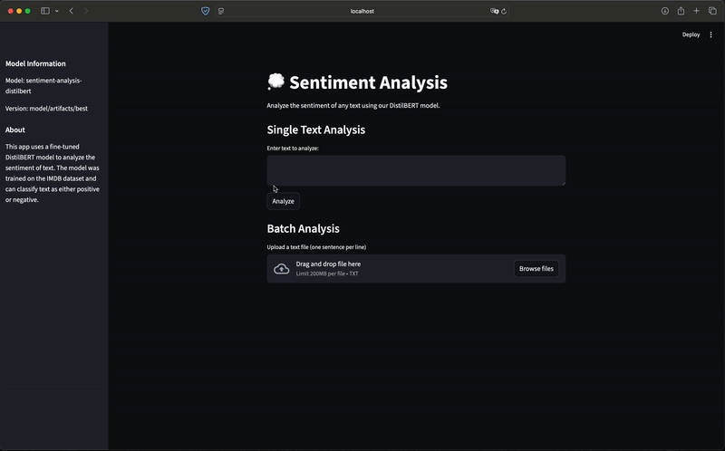
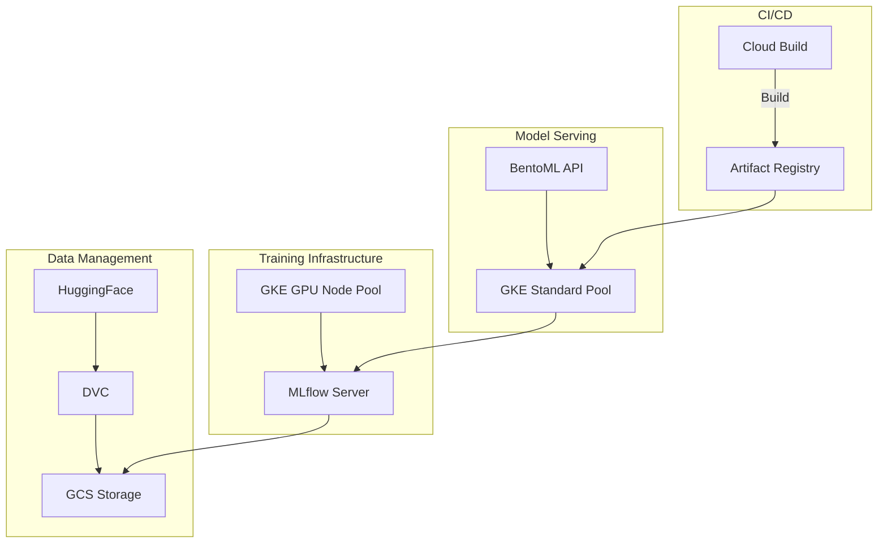
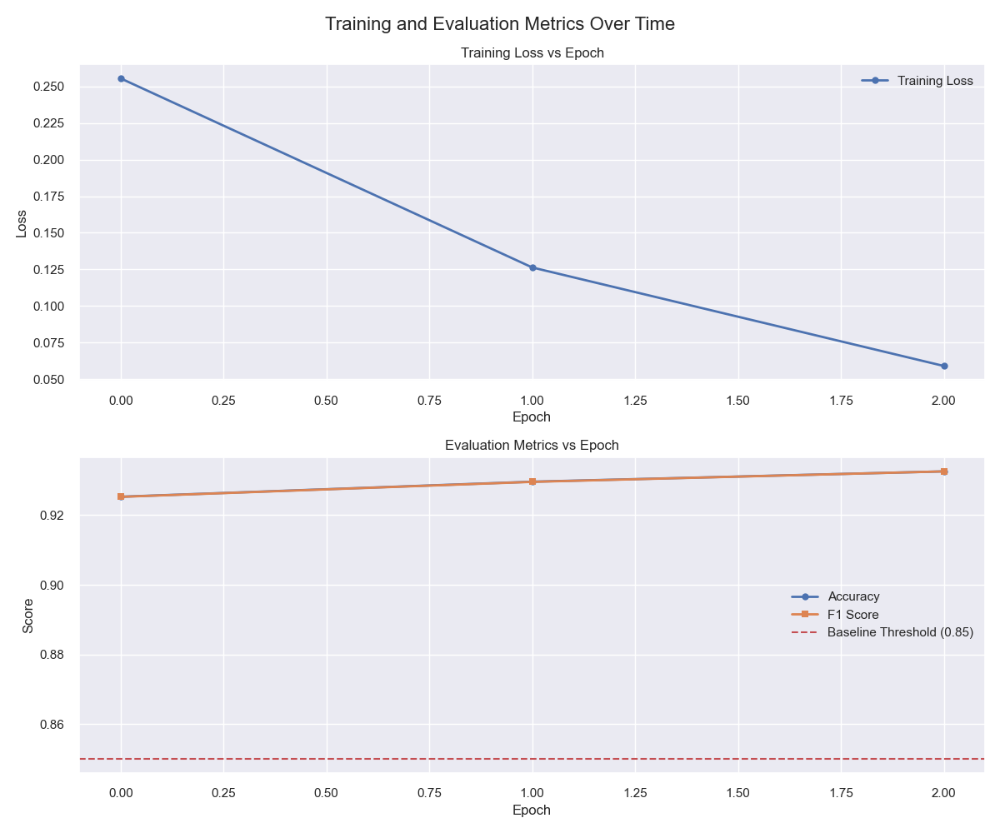
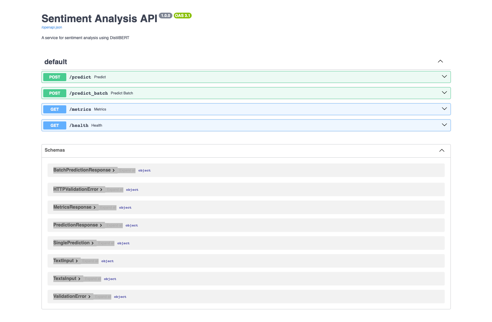
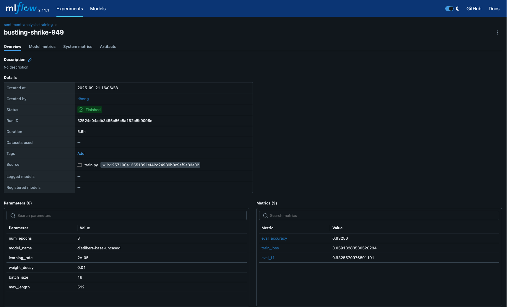
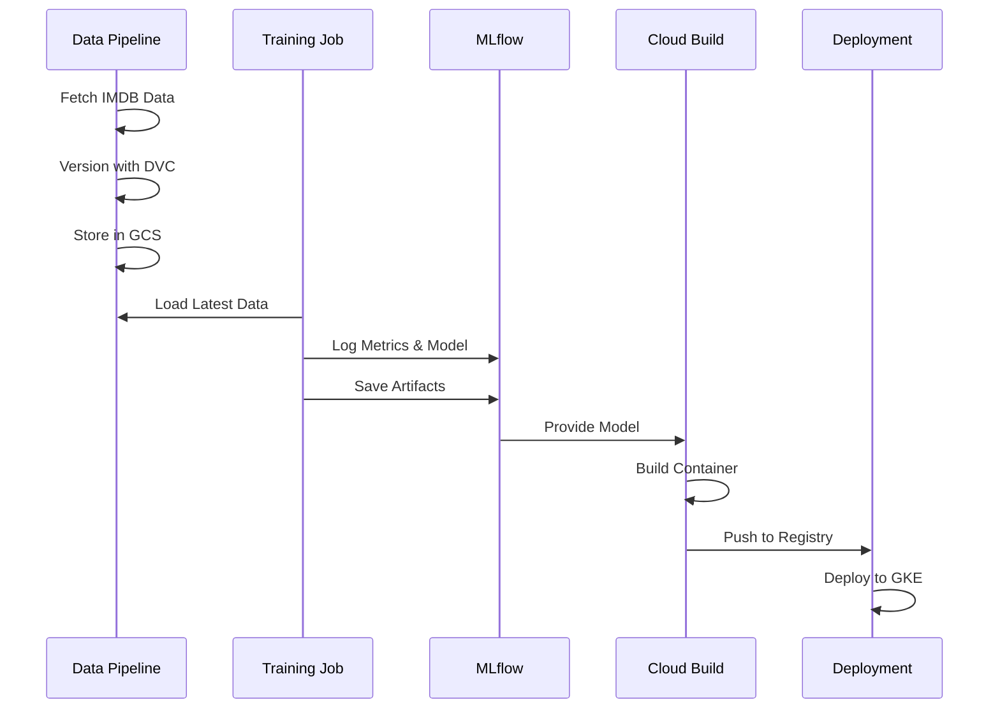

# SentimentOps: Production-Grade Sentiment Analysis with DistilBERT


A production-ready sentiment analysis service built with DistilBERT and modern MLOps practices. This project demonstrates end-to-end machine learning operations, from training to production deployment, incorporating industry best practices for scalability, monitoring, and continuous improvement.

<p align="center">
  
  <br>
  <em>Live Demo of the Sentiment Analysis Service</em>
</p>

## 🌟 Key Features

- **High-Performance Model**: Fine-tuned DistilBERT achieving 92%+ accuracy on IMDB reviews
- **Scalable Architecture**: Kubernetes-based deployment with GKE
- **MLOps Best Practices**: Experiment tracking with MLflow, model versioning, and automated training pipeline
- **Cost-Efficient**: GPU training with CPU inference optimization
- **CI/CD Integration**: Automated builds and deployments with Cloud Build

## 🏗️ Architecture

The system follows a modern microservices architecture with clear separation of concerns:



## 🚀 Getting Started

### Prerequisites

- Python 3.11+
- Google Cloud Platform account
- `gcloud` CLI configured
- `kubectl` configured for GKE
- Terraform 1.0+

### Quick Start

1. **Clone and Setup**

   ```bash
   git clone https://github.com/yourusername/DistilBERT-Sentiment-Analysis
   cd DistilBERT-Sentiment-Analysis
   python -m venv venv
   source venv/bin/activate  # or venv\Scripts\activate on Windows
   pip install -r requirements.txt
   ```

2. **Infrastructure Setup**

   ```bash
   cd infra/terraform
   terraform init
   terraform apply
   ```

3. **Deploy Services**

   ```bash
   kubectl apply -f infra/k8s/
   ```

4. **Access the Application**
   ```bash
   kubectl get ingress sentiment-frontend
   # Open the provided IP in your browser
   ```

## 📊 Model Performance

Our fine-tuned DistilBERT model achieves:

- **Accuracy**: 92.5% on test set
- **F1 Score**: 0.924
- **Inference Latency**: P95 < 100ms

<p align="center">
  
  <br>
  <em>Training Metrics and Model Performance Visualization</em>
</p>

## 🔌 API Documentation

The service exposes a RESTful API for sentiment analysis:

<p align="center">
  
  <br>
  <em>Interactive Swagger API Documentation</em>
</p>

## 🛠️ Technical Stack

- **ML/DL**: PyTorch, Transformers, DistilBERT
- **MLOps**: MLflow, DVC, BentoML
- **Infrastructure**: GKE, Terraform, Docker
- **CI/CD**: Cloud Build
- **Frontend**: Streamlit

## 📈 Experiment Tracking

Track model training and evaluation metrics with MLflow:

- Training loss and accuracy
- Model hyperparameters
- Evaluation metrics on test set
- Model artifacts and versions

<p align="center">
  
  <br>
  <em>MLflow Experiment Tracking and Model Registry</em>
</p>

## 🔄 MLOps Pipeline

Pipeline covering:

1. Data versioning and validation with DVC
2. Model training and evaluation with MLflow



## 🔐 Security

- Workload Identity for GCP service authentication
- RBAC for Kubernetes resources
- Secrets management via GCP Secret Manager

## 🙏 Acknowledgments

- HuggingFace team for the DistilBERT model
- IMDB dataset providers
- Open source MLOps tools maintainers
