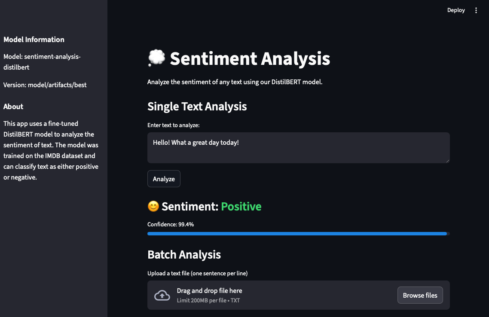
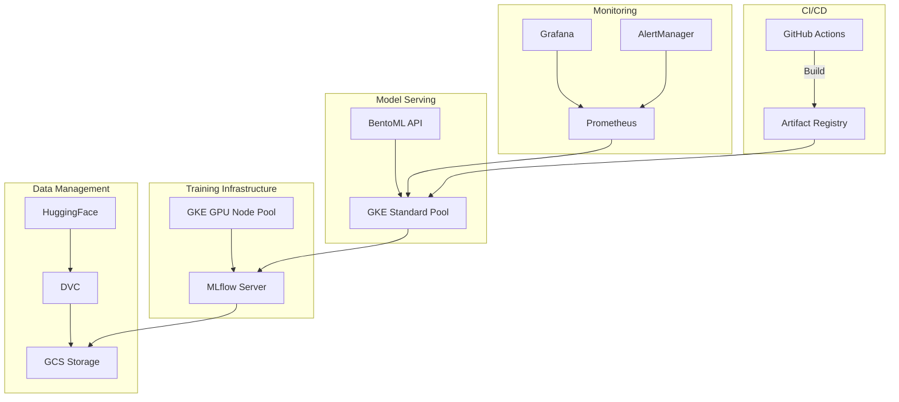

# SentimentOps: Production-Grade Sentiment Analysis with DistilBERT


A production-ready sentiment analysis service built with DistilBERT and modern MLOps practices. This project demonstrates end-to-end machine learning operations, from training to production deployment, incorporating industry best practices for scalability, monitoring, and continuous improvement.

<p align="center">
  
  <br>
  <em>Streamlit Frontend Interface for Sentiment Analysis</em>
</p>

## 🌟 Key Features

- **High-Performance Model**: Fine-tuned DistilBERT achieving 92%+ accuracy on IMDB reviews
- **Scalable Architecture**: Kubernetes-based deployment with automatic scaling
- **Production-Ready**: Comprehensive monitoring, alerting, and drift detection
- **MLOps Best Practices**: Automated training, evaluation, and deployment pipelines
- **Cost-Efficient**: GPU training, CPU inference, and resource auto-scaling

## 🏗️ Architecture

The system follows a modern microservices architecture with clear separation of concerns:



## 🚀 Getting Started

### Prerequisites

- Python 3.11+
- Google Cloud Platform account
- `gcloud` CLI configured
- `kubectl` configured for GKE
- Terraform 1.0+

### Quick Start

1. **Clone and Setup**

   ```bash
   git clone https://github.com/yourusername/DistilBERT-Sentiment-Analysis
   cd DistilBERT-Sentiment-Analysis
   python -m venv venv
   source venv/bin/activate  # or venv\Scripts\activate on Windows
   pip install -r requirements.txt
   ```

2. **Infrastructure Setup**

   ```bash
   cd infra/terraform
   terraform init
   terraform apply
   ```

3. **Deploy Services**

   ```bash
   kubectl apply -f infra/k8s/
   ```

4. **Access the Application**
   ```bash
   kubectl get ingress sentiment-frontend
   # Open the provided IP in your browser
   ```

## 📊 Model Performance

Our fine-tuned DistilBERT model achieves:

- **Accuracy**: 92.5% on test set
- **F1 Score**: 0.924
- **Inference Latency**: P95 < 100ms

<p align="center">
  
  <br>
  <em>Training Metrics and Model Performance Visualization</em>
</p>

## 🔌 API Documentation

The service exposes a RESTful API for sentiment analysis:

<p align="center">
  
  <br>
  <em>Interactive Swagger API Documentation</em>
</p>

## 🛠️ Technical Stack

- **ML/DL**: PyTorch, Transformers, DistilBERT
- **MLOps**: MLflow, DVC, BentoML
- **Infrastructure**: GKE, Terraform, Docker
- **Monitoring**: Prometheus, Grafana, Evidently
- **CI/CD**: GitHub Actions, Cloud Build
- **Frontend**: Streamlit

## 📈 Monitoring & Observability

Comprehensive monitoring setup with:

- Real-time performance metrics
- Data drift detection
- Custom Grafana dashboards
- Automated alerts

<p align="center">
  
  <br>
  <em>MLflow Experiment Tracking and Model Registry</em>
</p>

## 🔄 MLOps Pipeline

Automated pipeline covering:

1. Data versioning and validation
2. Model training and evaluation
3. Canary deployments
4. Performance monitoring
5. Automated retraining

```mermaid
sequenceDiagram
    participant Data as Data Pipeline
    participant Train as Training Job
    participant MLflow
    participant Registry
    participant Deploy as Deployment

    Data->>Data: Fetch IMDB Data
    Data->>Data: Validate Schema
    Data->>Data: Version with DVC

    Train->>Data: Load Latest Data
    Train->>MLflow: Log Metrics
    Train->>MLflow: Save Model

    MLflow->>Registry: Register if Better
    Registry->>Registry: Stage → Production

    Deploy->>Registry: Pull Latest Model
    Deploy->>Deploy: Build Container
    Deploy->>Deploy: Canary Deploy
    Deploy->>Deploy: Monitor & Promote
```



## 🔐 Security

- Workload Identity for GCP service authentication
- RBAC for Kubernetes resources
- Secrets management via GCP Secret Manager
- Network policies for service isolation

## 📚 Documentation

- [Project Overview](PROJECT.md)
- [API Documentation](app/README.md)
- [Infrastructure Setup](infra/README.md)
- [Training Pipeline](app/training/README.md)

## 📝 License

This project is licensed under the MIT License - see the [LICENSE](LICENSE) file for details.

## 🙏 Acknowledgments

- HuggingFace team for the DistilBERT model
- IMDB dataset providers
- Open source MLOps tools maintainers
